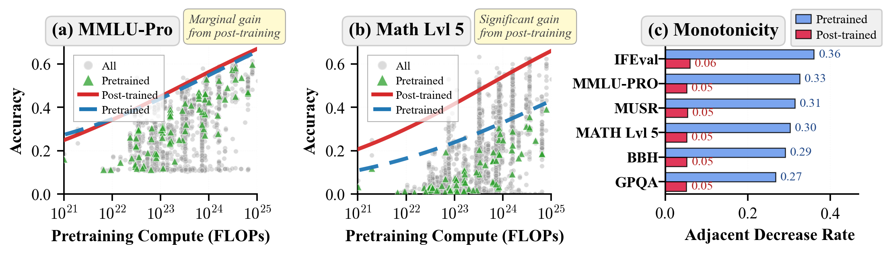
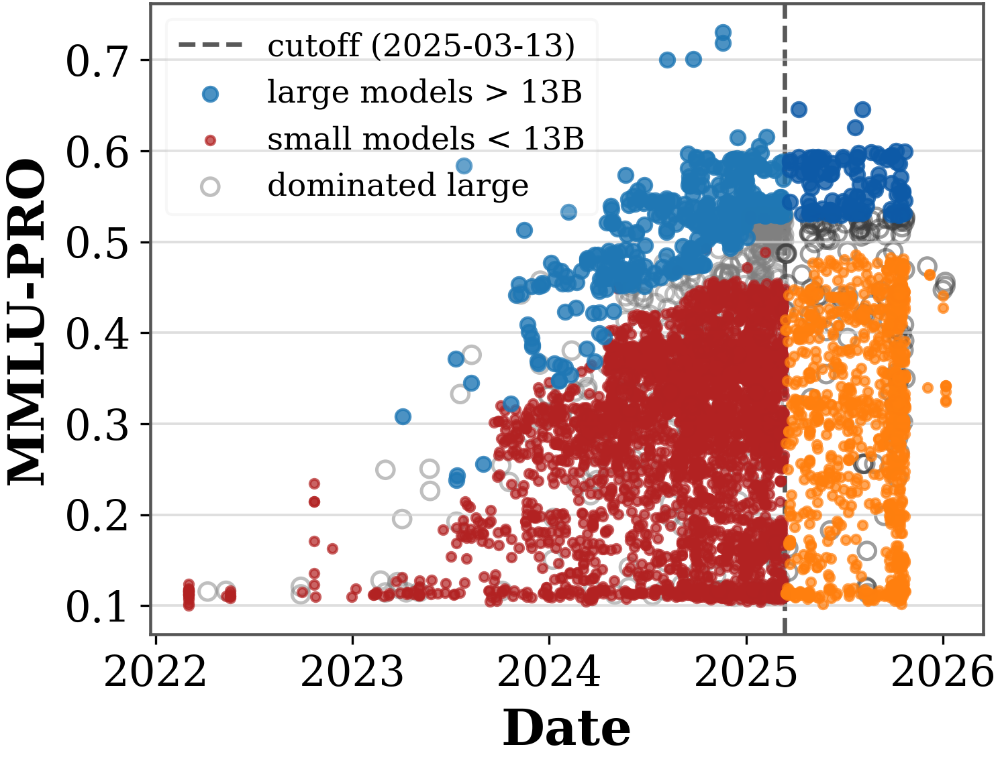
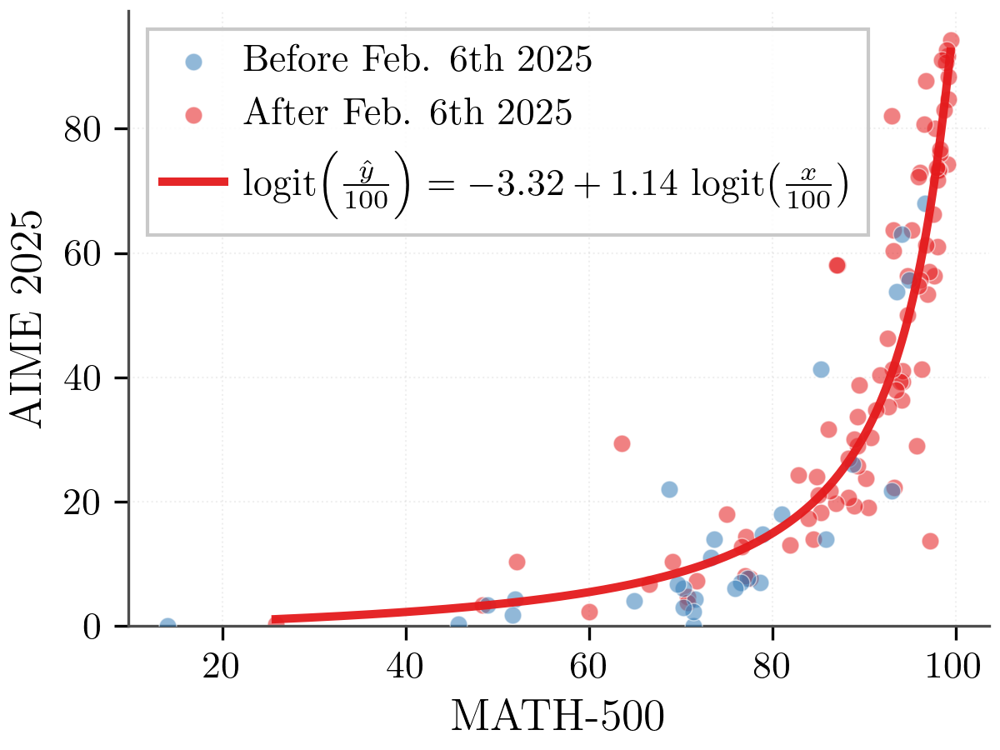

*Co-authored with Hanlin Zhang, Vasilis Syrgkanis, and Sham M. Kakade.*

## TL;DR

- Classical scaling laws (e.g., [Kaplan et al., 2020](https://arxiv.org/abs/2001.08361); [Hoffmann et al., 2022](https://arxiv.org/abs/2203.15556)) describe average trends for pretrained models, but practitioners making deployment decisions need to know what realistic performance is attainable after post-training under a given compute budget.
- We introduce **prescriptive scaling**: a compute-to-outcome map that estimates the best performance strong post-training practice can reliably attain at a given compute level (technically, a high conditional quantile of benchmark scores as a function of log pre-training FLOPs).
- Across many tasks, the boundary is a simple **monotone, saturating sigmoid**. Boundaries are mostly stable across model generations, with **math reasoning** as the clearest moving frontier.
- We apply prescriptive scaling as a diagnostic tool for two recurring evaluation concerns: **saturation** and **contamination**. Saturation is strongly task-dependent; contamination tests show no strong aggregate signal of inflation, though modest effects cannot be ruled out.
- To make frontier estimation practical under limited evaluation budgets, we propose a sampling algorithm that recovers near-full boundaries with about **20%** of evaluation budget (and about **5%** on some tasks).
- We release **Proteus-2k**, a large new evaluation set of about 2.4k open-weight models that we use in our study.

**Table 1. Estimated attainable accuracies at $10^{24}$ FLOPs.**

| Benchmark | IFEval | BBH | MATH Lvl 5 | GPQA | MUSR | MMLU-PRO |
| --- | ---: | ---: | ---: | ---: | ---: | ---: |
| Attainable accuracy @ $10^{24}$ FLOPs | 0.828 | 0.700 | 0.539 | 0.424 | 0.535 | 0.563 |

## Why Leaderboards Look Noisy

If scaling is so reliable, why do leaderboard plots often look chaotic?

At similar model scales, scores can vary widely. Smaller models occasionally beat larger ones. Post-training strategy (including instruction tuning and RLHF; see [Ouyang et al., 2022](https://arxiv.org/abs/2203.02155)), data curation, and elicitation details can dominate the final score. For instance, a single 1B-parameter base family (Llama-3.2-1B) has post-trained derivatives range from 0.08 to 0.48 on MATH Lvl 5 (and from 0.36 to 0.83 on BBH), despite sharing essentially the same pretraining scale.

This is not a contradiction of scaling; it is a mismatch between what traditional scaling laws were designed to predict and what practitioners actually need to plan.

In practice, people care about a different question: **Given pre-training compute $C$, what downstream score should I expect to reach with competitive post-training?** Prescriptive scaling starts from that operational need: rather than asking "how does loss decrease on average?", we ask "what is realistically attainable at compute $C$?".

## From Average Trends to Attainable Performance

The central methodological shift is to move from predicting average performance to characterizing attainable performance: the level that strong practice can reliably reach.

Concretely, at a fixed compute level, we estimate the $\tau$-percentile score across the observed population of post-trained models. This captures what well-executed pipelines can achieve, while remaining robust to occasional outliers and one-off spikes (quantile regression; [Koenker & Bassett, 1978](https://doi.org/10.2307/1913643)). We choose $\tau=0.98$.

Our analysis draws on over 7,000 model evaluations from three complementary sources: about 4.6k models from the [Open LLM Leaderboard](https://huggingface.co/spaces/open-llm-leaderboard-old/open_llm_leaderboard) and [Open LLM Leaderboard v2](https://huggingface.co/spaces/open-llm-leaderboard/open_llm_leaderboard), public frontier-model data from [Epoch AI's AI Model Database](https://epoch.ai/data/ai-models) and [LifeArchitect.AI](https://lifearchitect.ai/), and Proteus-2k, a new set of about 2.4k open-weight models we evaluate ourselves using the same leaderboard pipeline.

For context on downstream predictability and observational scaling, see [Ruan et al., 2024](https://arxiv.org/abs/2405.10938), [Schaeffer et al., 2024](https://arxiv.org/abs/2406.04391), and [Lourie et al., 2025](https://arxiv.org/abs/2507.00885).

With a definition of "attainable" in hand, the next question is simple: what functional form best describes this boundary, and does it generalize forward in time?

## A Simple Sigmoid Boundary

A surprising empirical result is that capability boundaries are well-fit by a simple sigmoid in log compute. It matches engineering intuition: big gains early, diminishing returns later, and ceiling effects.

The sigmoid form,

$$q_\tau(z) = y_0 + L\,\sigma(a + \beta z),$$

has only four parameters yet captures the full compute-to-performance mapping. The floor $y_0$ represents minimal baseline performance; the ceiling $y_0 + L$ reflects the task's effective difficulty limit; and the slope $\beta$ governs how quickly additional compute translates into gains. This parsimony is not just aesthetic: it makes the boundary easier to fit, compare, and update.

You can already see this pattern in Figure 1: across benchmarks and periods, the attainable boundary rises smoothly with compute and then saturates, which is exactly the behavior a sigmoid captures.

To quantify how well a fitted boundary generalizes to new model releases, we track two metrics:

- **Pinball loss** (quantile loss): an accuracy metric for predicting the $\tau$-quantile boundary.
- **Coverage error**: a calibration metric that checks whether about a fraction $\tau$ of models actually fall below the predicted $\tau$ boundary.

Formally, for an observed score $y$ and a predicted boundary $\hat q$, the pinball loss is:

$$
\ell_\tau(y, \hat q) =
\begin{cases}
\tau\,(y-\hat q), & y \ge \hat q, \\
(1-\tau)\,(\hat q-y), & y < \hat q.
\end{cases}
$$

Lower is better. At $\tau \approx 1$, it heavily penalizes setting the boundary *too low* (because many points would fall above it).

On a held-out set of $n$ models, the empirical coverage is

$$
\widehat{c}_\tau = \frac{1}{n}\sum_{i=1}^{n} \mathbf{1}\{y_i \le \hat q_\tau(z_i)\},
\quad
\mathrm{coverage\ error} = \left|\widehat{c}_\tau - \tau\right|.
$$

Under-coverage means $\widehat{c}_\tau < \tau$: too many models land above the predicted boundary.

With these metrics in hand, in out-of-time validation (fit on one release period and test on the next), the sigmoid matches a more flexible monotone spline in predictive accuracy while delivering better-calibrated $\tau$-coverage than binwise frontiers, with about 20% lower out-of-distribution pinball loss and about 32% lower out-of-distribution coverage error than a constant baseline.

In short, the sigmoid's simplicity is a feature, not a limitation. But does this relationship stay stable as training and post-training recipes evolve? We turn to that next.

## Is It Stable Over Time? Mostly Yes, Except Math

A boundary is only useful if it still works when the next wave of models arrives.

We partition all evaluated models into four chronological periods (roughly quarterly), then fit the boundary on one period and test whether it still holds on the next. For BBH, GPQA, MMLU-Pro, and MUSR, compute-only sigmoid boundaries transfer well: the predicted $\tau$-quantile curve remains well-calibrated on the next period of releases.

Math reasoning behaves differently. On MATH Lvl 5, later models exceed earlier fitted boundaries more often than expected, which shows up as under-coverage (more than the expected $1-\tau$ fraction of models landing above a $\tau$-boundary) and higher pinball loss. In other words, the community's post-training recipes for math have been genuinely improving: not just scaling up, but getting better at eliciting mathematical reasoning from the same compute budget.

> **Key takeaway:** For most benchmarks, a compute-only sigmoid fitted on earlier releases still accurately predicts what later models can achieve. The exception is math reasoning, where the attainable frontier keeps advancing.

Figure 5 below makes this visible for MATH Lvl 5: newly released open-weight models increasingly land above the earlier fitted boundary at the same pre-training compute level, especially at higher compute.

Next, we connect this post-training view back to the classical pre-training scaling-law perspective.

## Pre-training vs Post-training: Compute Predicts Potential Better Than Raw Scores

A recurring question in model development is how much of a base model's potential is already realized by the pretrained checkpoint versus unlocked by post-training. Our capability boundaries offer a quantitative answer.

Pretrained checkpoints can be locally non-monotone in compute on benchmark scores: larger base models do not always score higher than smaller ones. In contrast, the post-trained capability boundary is much more consistently monotone, revealing a clearer compute-to-capability relationship once competitive post-training is accounted for.

The size of the pretrain-to-post-train gap is also task-dependent. On knowledge-heavy tasks, pretrained models sit closer to the post-trained boundary. On reasoning and instruction-following tasks, the gap is much larger, meaning post-training can unlock substantially more of the compute-dependent potential.

This leads to a perhaps counterintuitive conclusion: if you want to predict how well a model can perform, look at its pre-training compute budget, not its pre-training benchmark scores.

> **Key takeaway:** Compute predicts potential; raw pretrained accuracy does not.

Figure 4 highlights this contrast directly: pretrained scores can wobble (and sometimes decline) as compute increases, while the post-trained boundary forms a much cleaner, monotone envelope.

With this lens, we can also revisit two recurring evaluation concerns: saturation and contamination.

## Two Case Studies: Saturation and Contamination

### 1) Saturation is task-dependent, not universal

Recent claims that "scaling is dead" ([Hooker, 2025](https://papers.ssrn.com/sol3/papers.cfm?abstract_id=5877662)) capture a real pattern on some benchmarks, but our analysis shows the picture is strongly task-dependent. Replication on [Open LLM Leaderboard v2](https://huggingface.co/spaces/open-llm-leaderboard/open_llm_leaderboard) contrasts a knowledge-heavy benchmark (MMLU-Pro) with a reasoning benchmark (MATH Lvl 5): MATH Lvl 5 appears more saturated for small models, while MMLU-Pro remains more scale-dominated.

A size-time boundary model quantifies this contrast: by the latest period, the estimated attainable score for a 13B model reaches about 0.94 on MATH Lvl 5 but only about 0.52 on MMLU-Pro. Small models have nearly closed the gap on math reasoning but remain far from the frontier on knowledge tasks.

The two saturation views below show this difference visually: the MMLU-Pro plot retains a strong scale advantage, while the MATH Lvl 5 plot shows much tighter clustering near a ceiling for smaller models.

### 2) Contamination diagnostics without over-claiming

For frontier models, we run a cross-benchmark shift test using MATH-500 and AIME-2025; the estimated post-AIME shift is positive but not statistically significant ($p = 0.15$). In other words, there is no strong aggregate signal of contamination-driven score inflation on AIME-2025, though modest effects cannot be ruled out.

Figure 7b provides an intuitive check: if AIME-2025 scores were broadly inflated relative to MATH-500, we would expect a clear upward shift on AIME-2025 beyond what the shared compute trend would predict. Instead, the observed shift is small and not statistically decisive.

More broadly, this connects to recent work cautioning that training on benchmark tasks can confound evaluation signals (see [Dominguez-Olmedo et al., 2024](https://arxiv.org/abs/2407.07890)).

These diagnostics are useful only if frontier estimation is practical at scale; next we discuss how to estimate boundaries under limited evaluation budgets.

## Practical Bonus: Recovering the Frontier Without Evaluating Everything

In practice, evaluating thousands of models across multiple benchmarks is computationally expensive and often unnecessary. Can we estimate the capability boundary from a carefully chosen subset?

The key observation is redundancy: many models sit in the same compute regime, so scoring all of them provides diminishing returns for boundary estimation. What we actually need is a set of evaluations that "pins down" the boundary across the full compute range.

We therefore frame evaluation selection as an experimental-design problem (optimal design; see [Goos et al., 2016](https://doi.org/10.1080/01621459.2015.1136632)). Let $z = \log_{10}(\mathrm{FLOPs})$ be the compute coordinate and let $c_i$ be an evaluation cost proxy for model $i$ (we approximate cost as proportional to parameter count). Given a budget fraction $\alpha$ of the full evaluation cost, we want a subset $S$ that is maximally informative for predicting the boundary everywhere, not just where models are most plentiful.

**I-optimality (information term).** We discretize compute into $B$ bins and choose $S$ to minimize the average predictive variance of the fitted boundary $\hat q_\tau(z)$ at the bin midpoints. Intuitively: prefer evaluations that reduce uncertainty in the predicted curve across compute, not merely uncertainty in its parameters.

In practice, this tends to select a mix of models that anchor the low-compute floor, the high-compute ceiling, and the transition region where the sigmoid is steep (because those points most constrain the curve shape).

**Bin-balance (coverage term).** Pure information-based designs can still over-focus on dense regions and leave other compute regimes under-covered. To prevent this, we add a simple reward for spreading evaluations across bins:

$$
\Phi_{\mathrm{bal}}(S) = \sum_{b=1}^{B} \log\bigl(n_b(S) + \epsilon\bigr),
$$

where $n_b(S)$ counts how many selected models fall in bin $b$.

Putting these together, we maximize a combined criterion under a hard budget:

$$
\max_{S}\ \Phi_{\lambda}(S) = \Phi_{\mathrm{info}}(S) + \lambda\,\Phi_{\mathrm{bal}}(S)
\quad \text{s.t.}\quad \sum_{i \in S} c_i \le U.
$$

**How it runs in practice.** Starting from an initial boundary estimate, we greedily add models that provide the largest "gain per unit cost" in $\Phi_{\lambda}(S)$ until the budget is exhausted. Importantly, the selection depends only on metadata like $(z_i, c_i)$, so you can decide what to evaluate before spending any compute.

Figure 6 summarizes the payoff: estimation error falls sharply as budget increases, because a small, well-spread subset already captures most of the curve shape; beyond that, additional evaluations become largely redundant.

> **Key takeaway:** A small, well-spread subset often recovers most of the frontier: about 20% of the full evaluation budget is typically enough (and sometimes about 5% suffices).

With boundaries that are both interpretable and cheap to maintain, we can turn them into a concrete playbook.

## How to Use Capability Boundaries Tomorrow

1. **Budgeting for a target score**: Use the fitted boundary to invert "target score -> required compute", giving a realistic range for what competitive post-training can achieve.
2. **Diagnosing pipeline quality**: If your latest model sits well below the boundary at its compute level, the gap is unlikely to be a scaling problem; it more likely points to post-training recipe, data mixture, or prompt/elicitation as the bottleneck. The boundary tells you how much headroom exists.
3. **Monitoring true progress**: If new model releases consistently exceed the previously fitted boundary, this signals genuine algorithmic progress, not just more compute, and your planning curve should be updated.
4. **Choosing evaluation spend intentionally**: Maintain a live boundary by evaluating a small, strategically chosen subset of models each cycle rather than scoring every model on every benchmark.

## Closing and Release

Prescriptive scaling bridges the gap between scaling-law research and practical compute-budgeting decisions: given compute $C$, what performance is realistically attainable after post-training, and does that mapping remain reliable as the ecosystem evolves?

Our results show that high-quantile capability boundaries provide a simple and reliable compute-to-performance map for many tasks, while also surfacing where rapid progress is still happening, most clearly in math reasoning.

Beyond performance forecasting, the same framework provides principled tools for saturation analysis, contamination diagnostics, and budget-efficient frontier estimation.

We release **Proteus-2k** (evaluation data for about 2.4k models) and our full codebase at [control-scale](https://github.com/hlzhang109/control-scale). We hope these tools support ongoing capability-boundary tracking as the model ecosystem continues to evolve.

### References

- Beeching, Edward, Clementine Fourrier, Nathan Habib, et al. 2023. "[Open LLM Leaderboard](https://huggingface.co/spaces/open-llm-leaderboard-old/open_llm_leaderboard)." *Hugging Face Spaces*.
- Dominguez-Olmedo, Ricardo, Florian E. Dorner, and Moritz Hardt. 2024. "[Training on the Test Task Confounds Evaluation and Emergence](https://arxiv.org/abs/2407.07890)." *arXiv preprint arXiv:2407.07890*.
- Epoch AI. 2022. "[Parameter, Compute and Data Trends in Machine Learning](https://epoch.ai/data/ai-models)." *Epoch AI*.
- Fourrier, Clementine, Nathan Habib, Alina Lozovskaya, Konrad Szafer, and Thomas Wolf. 2024. "[Open LLM Leaderboard v2](https://huggingface.co/spaces/open-llm-leaderboard/open_llm_leaderboard)." *Hugging Face Spaces*.
- Goos, Peter, Bradley Jones, and Utami Syafitri. 2016. "[I-Optimal Design of Mixture Experiments](https://doi.org/10.1080/01621459.2015.1136632)." *Journal of the American Statistical Association* 111 (514): 899-911.
- Hoffmann, Jordan, Sebastian Borgeaud, Arthur Mensch, et al. 2022. "[Training Compute-Optimal Large Language Models](https://arxiv.org/abs/2203.15556)." *Advances in Neural Information Processing Systems*.
- Hooker, Sarah. 2025. "[On the Slow Death of Scaling](https://papers.ssrn.com/sol3/papers.cfm?abstract_id=5877662)." *SSRN*.
- Kaplan, Jared, Sam McCandlish, Tom Henighan, et al. 2020. "[Scaling Laws for Neural Language Models](https://arxiv.org/abs/2001.08361)." *arXiv preprint arXiv:2001.08361*.
- Koenker, Roger, and Gilbert Bassett. 1978. "[Regression Quantiles](https://doi.org/10.2307/1913643)." *Econometrica* 46 (1): 33-50.
- LifeArchitect.AI. n.d. "[AI Model Leaderboards](https://lifearchitect.ai/)." *LifeArchitect.AI*.
- Lourie, Nicholas, Michael Y. Hu, and Kyunghyun Cho. 2025. "[Scaling Laws Are Unreliable for Downstream Tasks: A Reality Check](https://arxiv.org/abs/2507.00885)." *arXiv preprint arXiv:2507.00885*.
- Ouyang, Long, Jeffrey Wu, Xu Jiang, et al. 2022. "[Training Language Models to Follow Instructions with Human Feedback](https://arxiv.org/abs/2203.02155)." *Advances in Neural Information Processing Systems* 35: 27730-27744.
- Ruan, Yangjun, Chris J. Maddison, and Tatsunori B. Hashimoto. 2024. "[Observational Scaling Laws and the Predictability of Language Model Performance](https://arxiv.org/abs/2405.10938)." *Advances in Neural Information Processing Systems* 37: 15841-15892.
- Schaeffer, Rylan, Hailey Schoelkopf, Brando Miranda, et al. 2024. "[Why Has Predicting Downstream Capabilities of Frontier AI Models with Scale Remained Elusive?](https://arxiv.org/abs/2406.04391)." *arXiv preprint arXiv:2406.04391*.
